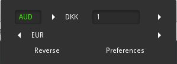
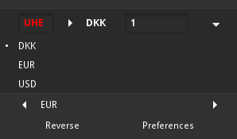

# gnome-shell-extensions-currency-converter

### Description

This gnome-shell extension allows you to quickly convert an amount from a currency to another one.
The currency rates are the current ones proposed on the websites listed below. The implementation of the requests is based on the RESTful API available on the given website, and ensures an accurate currency rate.

Can be used with the following API providers:
 * https://currencylayer.com/
 * https://fixer.io/
 * https://www.exchangerate-api.com/
 * https://openexchangerates.org/

### Requirements

Create your free account on one of the websites above. Insert then your personal and unique API key in the Preferences menu.

### First use
#### The choice of the currencies
Go to the Preferences window to set your favorite currencies that will be available in the extension.
When the extension starts, the SOURCE currency is based on the FIRST of the favorite currencies list, and the TARGET currency is based on the SECOND of the favorite currencies list. This favorite list is easily cahnged by selecting the checkboxes of the currencies you want.

After changing the favorite currencies, refresh Gnome-shell by Alt+F2 and type 'r', or disable/enable in the extensions of Gnome Tweak Tool.

#### The choice of the converter
The Preferences menu allows the user choosing his API provider.

### Custom currencies (optional)
The extension allows the user to write the currency code of his choice (e.g. AUD for AUstralian Dollar). If the currency code doesn't exist, the extension will clear the current result and not perform anything.. If the custom currency is valid, it is highlighted in green, and red otherwise. 

Valid custom currency:  

Invalid custom currency:  

### Result in the panel menu
In the preferences, the user can activate the option to display the result of a conversion in the panel menu bar (instead of the original extension's icon). The user can at anytime then clear the result in the panel menu with the Clear button in the bottom rigth corner of the extension menu.

