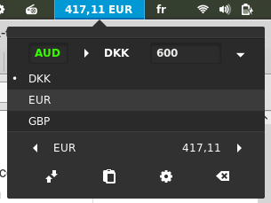
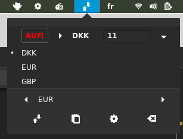

# gnome-shell-extensions-currency-converter

###DESCRIPTION

This gnome-shell extension allows you to quickly convert an amount from a currency to another one.
The currency rates are the current ones proposed on the website www.currencylayer.com. The implementation of the requests is based on the RESTful API available on the website, and ensures an accurate currency rate.

###REQUIREMENTS

Create your free account on www.currencylayer.com. Insert then your personal and unique API key in the Preferences menu.

###FIRST USE
Go to the Preferences window to set your favorite currencies that will be available in the extension.
When the extension starts, the SOURCE currency is based on the FIRST of the favorite currencies list, and the TARGET currency is based on the SECOND of the favorite currencies list. This favorite list is easily cahnged by selecting the checkboxes of the currencies you want.

After changing the favorite currencies, refresh Gnome-shell by Alt+F2 and type 'r', or disable/enable in the extensions of Gnome Tweak Tool.

###CUSTOM CURRENCIES (optional)
The extension allows the user to write the currency code of his choice (e.g. AUD for AUstralian Dollar). If the currency code doesn't exist, the extension will ignore it and use the selected currency among the favorite currencies list. If the custom currency is valid, it is highlighted in green, and red otherwise.

Valid custom currency:  

Invalid custom currency (DKK is then used):  

###CHANGELOG

2015/10/01: option allowing to enter manually FROM and TO currencies.

